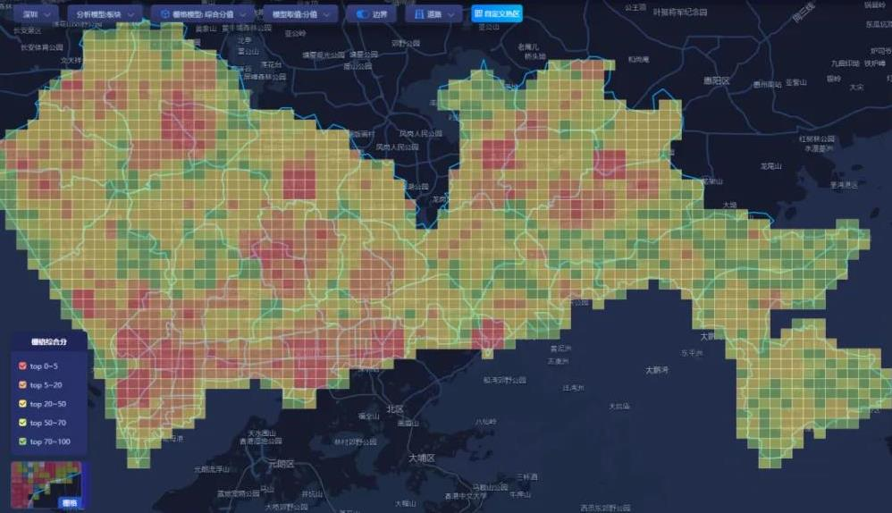
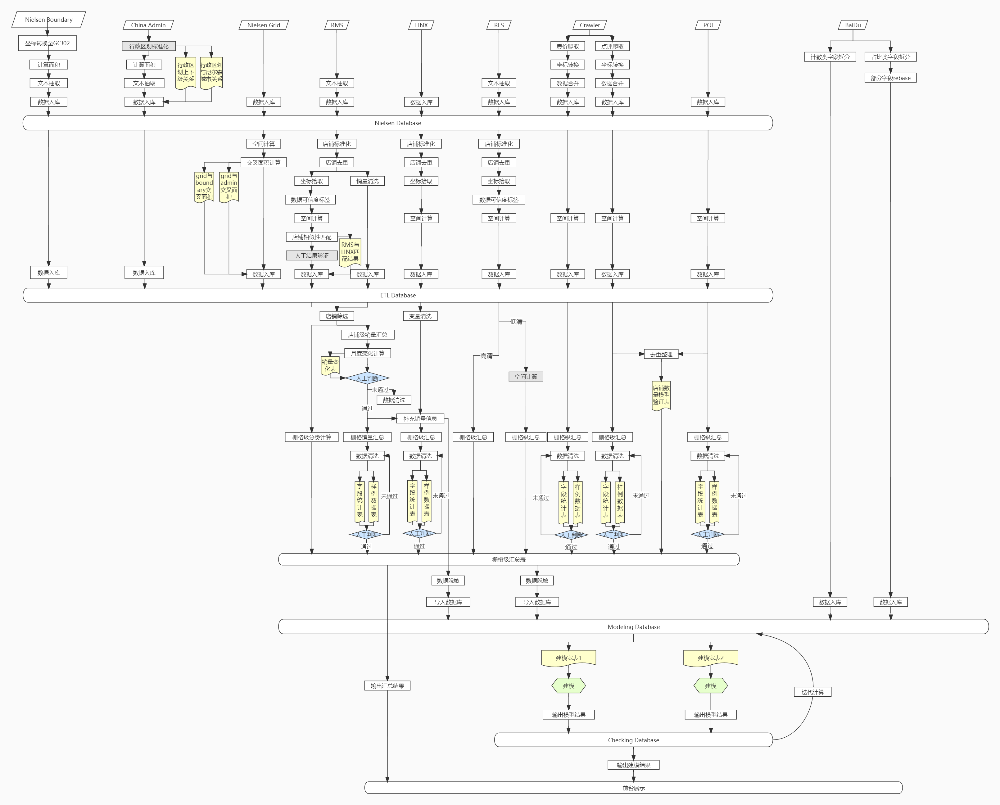

# IntelliGEO（商业置景）
简体中文 | [English](README_EN.md)

## 项目产出
- 将全中国拆分成1km * 1km栅格，在每个栅格中提供所有人口数量、行为特征、建筑物等基础地理信息，并提供任意category级别的零售行业销售潜力指数
- 基于上述基础信息提供卖场本体、前置仓库等选址建议。客户企业包括顺丰、滴滴优选等
- 基于基础信息提供品牌商铺货建议，客户企业包括：百事可乐、可口可乐、康师傅、保洁等
- 信息整合后的区县、城市级报告。以及商圈划分建议。

效果如下

## 数据类型
- 人口数量
    - 总到访人口
    - 总居住人口
    - 分时段到访、居住人口
- 人口属性
    - 年龄
    - 性别
    - 收入
    - 教育水平
    - 其他
- 人口行为
    - 消费行为
    - 互联网行为
    - 兴趣、偏好
    - 其他
- 建筑物
    - 零售相关
    - 金融相关
    - 商业相关
    - 住宅
    - 景区
    - 其他
- 互联网数据
    - 点评店铺信息
    - 美团等外卖数据
- 销售潜力
    - 分品类年销量预测
    - 分品类年销售额预测
    - 其他
    
## 模型流程
1. 数据收集：   
   - 所有数据以坐标点形式（建筑物，人数等）、点值平均（属性特征等）、面积加权均摊（图层数据等）的方法汇集到1km * 1km的栅格中，作为项目的基础数据条目
2. 数据清洗：  
   - 对基础数据做初步清洗，去除占比过少的比例值（< 0.5%），缺失值过多（> 95%）的标签。删选过后共计960w条数据，2k+标签值。作为入模特征和最终输出结果
3. 特征工程：  
   - 包括分组标准化、特征加工等标准化特征工程
4. 建模：
   - 模型使用XGBoost，分品类对销量和销售额进行预测。 数据根据城市级别、店铺类型进行分组，使用spark调度并行计算1k左右个不同的模型。
5. 模型校准和解释  
   - 使用XGBoost模型重要性，结合SHAP算法综合提供特征重要性
   - 结合政府<社会消费品零售总额>趋势对数据进行整体性校准。部分核心区域进行人工采店校准

## 技术框架
- 数据存储于Hadoop集群下，共8个节点。
- 使用hive进行数据分析和简单加工
- 使用Azkaban进行任务调度
- 使用Spark进行模型并行计算，Sklearn进行特征工程和部分数据处理，XGBoost进行模型推理
- 使用Django搭建前端服务器，进行web端展示

详见下方流程图

## 我的角色
- 项目提出者，方案、流程设计人
- 数据负责人。筛选底层数据供应商，评比、检验不同供应商的数据质量
- 模型算法负责人。带领团队编写预测算法、特征工程、校准等；构建模型pipeline，编写spark分发推理代码
- 销量预测质量责任人

